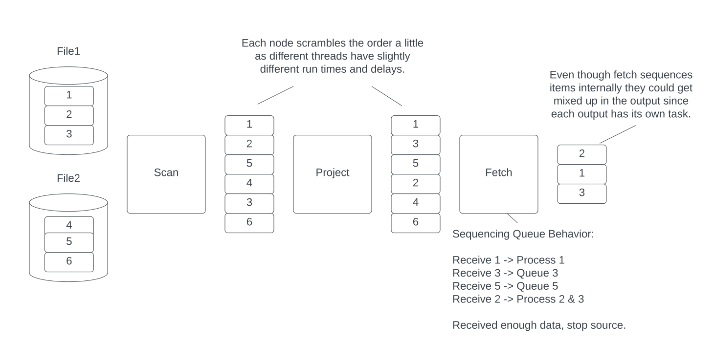

# 开发者指南

本页详细介绍了 Acero 的设计。它讨论了如何创建自定义执行节点，并描述了 Acero 设计和实现背后的一些理念。
最后，它概述了如何使用新行为扩展 Acero 以及如何将此新行为上游到核心 Arrow 存储库中。

## 了解ExecNode

ExecNode 是一个抽象类，具有几个纯虚拟方法，这些方法控制节点的运行方式：

### `ExecNode::StartProducing`

此方法在计划开始时调用一次。大多数节点都会忽略此方法（任何必要的初始化都应在构造函数或 Init
中进行）。但是，源节点通常会提供自定义实现。源节点应安排开始读取和提供数据所需的任何任务。源节点通常是计划中任务的主要创建者。

:::info
ExecPlan 采用基于推送的模型运行。源通常基于
拉取。例如，您的源可能是一个迭代器。源节点
通常会安排任务从源中拉取一个项目，并将该项目
推送到源的输出节点（通过`InputReceived`）。
:::

#### Examples

- 在 `table_source` 节点中，输入表被分成多个批次。
为每个批次创建一个任务，该任务在节点的输出上调用 `InputReceived`。

- 在 `scan` 节点中创建一个任务以开始从数据集中列出片段。然后，每个列出任务都会创建任务以异步方式从片段中读取批次。当批次完全读入时，延续将使用执行计划安排新任务。此
任务在扫描节点的输出上调用 `InputReceived`。

### `ExecNode::InputReceived`

在执行计划期间，此方法会被多次调用。它是节点之间传递数据的方式。输入节点将在其输出上调用 InputReceived。Acero 的执行模型是基于推送的。
每个节点通过调用 InputReceived 并传入一批数据将数据推送到其输出中。

InputReceived 方法通常是节点实际工作发生的地方。例如，项目节点将执行其表达式并创建新的扩展输出批次。然后，它将在其输出上调用
InputReceived。InputReceived 永远不会在源节点上被调用。接收器节点永远不会调用 InputReceived。所有其他节点都会经历这两种情况。

某些节点（通常称为“管道断路器”）必须先累积输入，然后才能生成任何输出。例如，排序节点必须先累积所有输入，然后才能对数据进行排序并
生成输出。在这些节点中，InputReceived 方法通常会将数据放入某种累积队列中。如果节点没有足够的数据来操作，那么它就不会调
用 InputReceived。这将是当前任务的结束。


#### Examples

- `project` 节点运行其表达式，使用收到的批次作为表达式的输入。根据输入批次和表达式的结果创建一个新批
次。新批次被赋予与输入批次相同的顺序索引，然后节点在其输出上调用 `InputReceived`。
- `order_by` 节点将批次插入累积队列。如果这是最后一个批次，则节点将对累积队列中的所有内容进行排序。然后，
节点将对排序结果中每个批次的输出调用 `InputReceived`。将为每个批次分配一个新的批次索引。请注意，此最终输出步骤
也可能作为对 `InputFinished` 调用的结果发生（如下所述）。

### `ExecNode::InputFinished`

此方法将在每个输入上调用一次。一旦节点知道将向该输出发送多少个批次，它就会在其输出上调用
InputFinished。通常，这发生在节点完成工作时。例如，扫描节点将在读取完其文件后调用 InputFinished。
但是，如果它知道（可能来自文件元数据）将创建多少个批次，它可以更早地调用它。

一些节点将使用此信号触发某些处理。例如，排序节点需要等到它收到所有输入后才能对数据进行排序。它依赖于 InputFinished 调用来知道这已经发生了。

即使节点在完成时没有进行任何特殊处理（例如，项目节点或过滤器节点不需要进行任何流结束处理），该节点仍将在其输出上调用 InputFinished。

:::info
InputFinished 调用可能在对
InputReceived 的最终调用之前到达。事实上，它甚至可以在任何对
InputReceived 的调用开始之前发出。例如，表源节点始终确切地知道它将生成多少批次。它可以选择在调用
InputReceived 之前调用
InputFinished。如果节点需要执行
“流结束”处理，那么它通常使用 AtomicCounter，这是一个辅助类，用于确定所有数据何时到达。
:::


#### Examples

- `order_by` 检查是否已收到所有批次。如果已收到，则执行 `InputReceived` 示例中描述的排序
步骤。在开始发送输出数据之前，它会检查有多少个输出批次（批次大小可能在累积或排序过程中发生变化），并在节点的输出上调用 `InputFinished`。
- `fetch` 节点在调用 `InputReceived` 期间意识到它已收到所要求的所有行。它会立即在其输出
上调用 `InputFinished`（即使尚未调用其自己的 `InputFinished` 方法）

### `ExecNode::PauseProducing` / `ExecNode::ResumeProducing`

这些方法控制背压。某些节点可能需要暂停其输入以避免积累过多数据。例如，当用户使用 RecordBatchReader 使用
计划时，我们使用 SinkNode。SinkNode 将数据放在 RecordBatchReader 从中拉取的队列中（这是从推送模型到
拉取模型的转换）。如果用户正在缓慢地读取 RecordBatchReader，那么这个队列可能会开始填满。另一个例子是写入
节点。此节点将数据写入文件系统。如果写入速度很慢，那么数据可能会在写入节点处累积。因此，写入节点需要施加背压。

当节点意识到需要施加一些背压时，它将在其输入上调用 PauseProducing。一旦节点有足够的空间继续，它就会在其输入上
调用 ResumeProducing。例如，当队列太满时，SinkNode 会暂停。随着用户继续从 RecordBatchReader 读取，我们可
以预期队列会慢慢耗尽。一旦队列耗尽，SinkNode 就可以调用 ResumeProducing。

源节点通常需要为PauseProducing 和 ResumeProducing 提供特殊行为。例如，正在读取文件的扫描节点可以暂停读取文件。但是，某些
源节点可能无法以任何有意义的方式暂停。表源节点暂停没有多大意义，因为其数据已经在内存中。

既不是源也不是接收器的节点仍应转发背压信号。例如，当在项目节点上调用 PauseProducing 时，它应该在其输入上调用 PauseProducing。
如果节点有多个输入，则它应该将信号转发到每个输入。

#### Examples

- `write` 节点在其 `InputReceived` 方法中将一批数据添加到数据集写入器的队列中。如果数据集写入器已满，它将返回一个未完成
的未来，当有更多空间时它将完成。然后 `write` 节点在其输入上调用 `PauseProducing`。然后它将一个延续添加到未来，它将在其
输入上调用 `ResumeProducing`。
- `scan` 节点使用 `AsyncTaskScheduler` 来跟踪它安排的所有任务。此调度程序受到限制，以限制 `scan` 节点允许执行的并发 I/O 数
量。当调用 `PauseProducing` 时，节点将暂停调度程序。这意味着不会提交在节流阀后面排队的任何任务。但是，任何正在进行的 I/O 将继续
（背压不能立即生效）。当调用 `ResumeProducing` 时，`scan` 节点将取消暂停调度程序。

### `ExecNode::StopProducing`

当计划需要提前结束时，将调用 StopProducing。发生这种情况的原因可能是用户取消了计划，也可能是因为发生了错误。大多数节点不需要在这里
做任何事情。没有期望或要求节点发送其拥有的任何剩余数据。任何安排任务的节点（例如源节点）都应停止生成新数据。除了计划范围内的取消之外，如
果节点已确定已收到所需的所有数据，则可在其输入上调用此方法。但是，由于并行性，节点在停止输入后仍可能收到一些对 `InputReceived` 的调用。
如果使用了任何外部资源，则清理应作为此调用的一部分进行。

#### Examples

- `asofjoin` 节点有一个专用的处理线程，它使用队列与主 Acero 线程进行通信。当调
用 `StopProducing` 时，节点会将毒丸插入队列。这会告诉处理线程立即停止。一旦处理线程停止，
它会将其外部任务（如下所述）标记为已完成，从而允许计划完成。
- `InputReceived` 中的 `fetch` 节点可能决定它拥有所需的所有数据。然后它可以在其输入上调用 `StopProducing`。

### Initialization / Construction / Destruction

简单的初始化逻辑（不会出错）可以在构造函数中完成。如果初始化逻辑可能返回无效状态，则可以在 exec 节
点的工厂方法或`Init`方法中完成。对于简单的验证，工厂方法是首选。如果初始化可能会进行昂贵的分配或其他资源消
耗，则首选`Init`方法。`Init`将始终在调用`StartProducing`之前被调用。初始化也可以在`StartProducing`中完
成，但请记住，其他节点可能已在那时启动。

此外，还有一个 `Validate` 方法可以重载以提供自定义验证。此方法通常在 `Init` 之前调用，但在添加所有输入和输出之后调用。

如今，终结发生在析构函数中。目前有几个示例，这可能会很慢。例如，在写入节点中，如果在计划期间出现错误，那么我们可能会
在此处关闭一些打开的文件。如果有重要的终结，要么是异步的，要么可能触发错误，那么我们可以将 Finalize 方法引入 ExecNode 生
命周期。它尚未完成，只是因为还不需要它。

### 总结

|Method Name|This is called when...|A node calls this when...|
|:----------|:---------------------|:------------------------|
|StartProducing|The plan is starting|N/A|
|InputReceived|Data is received from the input|To send data to the output|
|InputFinished|The input knows how many batches there are|The node can tell its output how many batches there are|
|StopProducing|A plan is aborted or an output has enough data|A node has all the data it needs|

## 扩展 Acero

Acero 实例化了一个单例 `ExecFactoryRegistry`，它在名称和执行节点工厂（从选项创建 ExecNode 的方法）之间进行映射。要创建新
的 ExecNode，您可以在此注册表中注册节点，然后 Acero 就可以使用您的节点了。如果您希望能够将此节点与 Substrait 计划一起使用，
您还需要配置 Substrait 注册表，以便它知道如何将 Substrait 映射到您的自定义节点。这意味着您可以创建和添加新节点到 Acero，
而无需从源代码重新编译 Acero。

## 调度和并行

数据引擎可以通过多种方式利用多种计算资源（例如多个核心）。在深入了解 Acero 的调度细节之前，我们将介绍一些高级主题。

### 并行执行计划

用户可能希望同时执行多个计划，我们欢迎他们这样做。但是，Acero 没有跨计划调度的概念。每个计划都会尝试最大
限度地利用计算资源，并且可能会出现 CPU、内存和磁盘资源的争用。如果计划使用默认的 CPU 和 I/O 线程池，这种
情况会有所缓解，因为它们将共享同一个线程池。

### 本地分发计划

解决多线程问题的一种常见方法是将输入拆分为

分区，然后为每个分区创建一个计划，然后以某种方式合并这些计划的结果。例如，假设您有

20 个文件和 10 个核心，并且您想要读取和排序所有数据。您可以为每 2 个文件创建一个计划来读取和
排序这些文件。然后，您可以创建一个额外的计划，该计划从这 10 个子计划中获取输入，并以排序的方式合并 10 个输入流。

这种方法之所以流行，是因为它是查询在多​​个服务器上分布的方式，因此受到广泛支持和充分理解。Acero 目前不这样做，
但没有理由阻止它。向 Acero 添加 shuffle 和分区节点应该是高优先级，并将使 Acero 能够被分布式系统使用。一旦完成，如果需
要，应该可以进行本地 shuffle（本地意味着在单个系统上的多个执行计划实例之间进行交换）。


### 流水线并行

Acero 尝试使用流水线并行性来最大化并行性。当每一批数据从源到达时，我们会立即创建一个任务并开始处理它。这
意味着我们可能会在处理完 X-1 批数据之前开始处理 X 批数据。这非常灵活且功能强大。但是，这也意味着正确实现 ExecNode 很
困难。例如，ExecNode 的 InputReceived 方法应该是可重入的。换句话说，应该预期在完成对 InputReceived 的上一次调用之前将调
用 InputReceived。这意味着具有任何可变状态的节点都需要互斥锁或类似机制来保护该状态免受竞争条件的影响。这也意味着任
务很容易乱序，节点不应该期望其输入有任何特定的顺序（稍后会详细介绍）。


### 异步性

有些操作需要很长时间，而且可能不需要 CPU。从文件系统读取数据就是一个例子。如果每个核心只
有一个线程，那么等待这些操作完成的时间就会被浪费。这个问题有两种常见的解决方案。同步解决方案
通常是创建比核心更多的线程，并预期其中一些会被阻止，这是可以接受的。这种方法往往更简单，但可能导
致过多的线程争用，并且需要进行微调。

另一个解决方案是使慢速操作异步化。当慢速操作开始时，调用者放弃线程并允许其他任务同时运行。一旦慢速操
作完成，就会创建一个新任务来获取结果并继续处理。这有助于最大限度地减少线程争用，但实现起来往往更复杂。

由于缺乏标准 C++ 异步 API，Acero 采用了两种方法的组合。Acero 有两个线程池。第一个是 CPU 线
程池。此线程池每个核心有一个线程。此线程池中的任务永远不会阻塞（除了同步的轻微延迟）并且通常应
尽可能积极地使用 CPU。I/O 线程池上的线程预计大部分时间处于空闲状态。他们应该避免做任何 CPU 密集型工
作。他们的工作基本上是等待数据可用并在 CPU 线程池上安排后续任务。


:::info
Acero 中的大多数节点无需担心异步性。它们是完全同步的，不会产生任务。
:::


### 管道的任务 (and sometimes beyond)

引擎可以选择为节点的每次执行创建一个线程任务。但是，如果没有仔细的调度，这会导致缓
存局部性问题。例如，假设我们有一个基本计划，由三个执行节点组成，即扫描、项目和过滤（这
是一个非常常见的用例）。现在假设有 100 个批次。在每个操作符任务模型中，我们将有“扫描批
次 5”、“项目批次 5”和“过滤批次 5”等任务。这些任务中的每一个都可能访问相同的数据。例如，也
许“项目”和“过滤”节点需要读取相同的列。该列最初在“扫描”节点的解码阶段创建。为了最大限度地提高缓
存利用率，我们需要仔细安排我们的任务，以确保所有这三个任务连续运行并分配给同一个 CPU 核心。

为了避免这个问题，我们设计的任务在结束之前会经过尽可能多的节点。这个节点序列通常被称为“管
道”，而结束管道（从而结束任务）的节点通常被称为“管道断路器”。有些节点甚至可能介于两者之间。
例如，在哈希连接节点中，当我们在探测端收到一个批次，并且哈希表已经构建时，我们不需要结束任务，而
是继续运行。这意味着任务有时可能在连接节点结束，有时可能继续经过连接节点。


### 线程池和调度程序

CPU 和 I/O 线程池是核心 Arrow-C++ 库的一部分。
它们包含一个 FIFO 任务队列，并在线程可用时执行它们。对于 Acero，我们需要额外的功能。为此，我们使用
AsyncTaskScheduler。在最简单的操作模式下，调度程序
只需将任务提交给底层线程池。但是，它还能够创建可以应用节流、
优先级和任务跟踪的子调度程序：

- 节流调度程序将成本与每个任务相关联。只有在有空间的情况下，任务才会提交给底层调度程序。如果没有空间，则将任务放入队列中。写入
节点使用大小为 1 的节流来避免重新调用数据集写入器（数据集写入器执行其自己的内部调度）。节流调度程序可以手动暂停和取消暂停。暂
停时，所有任务都会排队，即使有空间也不会提交排队的任务。这在源节点中很有用，可以实现 PauseProducing 和 ResumeProducing。
- 可以对节流调度程序应用优先级，以控制提交排队任务的顺序。如果有空间，则立即提交任务（无论优先级如何）。但是，如果节流已满，则
任务将排队并受优先级排序。扫描节点会限制其生成的读取请求数量，并尽可能按顺序优先读取数据集。
- 任务组可用于跟踪任务集合，并在所有任务完成后运行完成任务。这对于分叉连接式问题非常有用。一旦文件的所有未完成的写入任务完成，写入节点就会使用任务组关闭文件。

目前已有研究和示例表明，执行引擎中存在不同的任务优先级排序方法。Acero 尚未解决这个问题。让我们来看看一些常见的情况：

- 引擎通常会优先从连接节点的构建端读取数据，然后再从探测端读取数据。在 Acero 中，通过施加背压，这将更容易处理。
- 另一个常见用例是控制内存累积。引擎将优先处理更靠近接收节点的任务，以缓解内存压力。但是，Acero 目前假设将
在管道断路器处添加溢出，并且计划中的内存使用量将或多或少保持静态（每个核心）并且远低于硬件的限制。如果 Acero
需要在具有许多计算资源和有限内存（例如 GPU）的环境中使用，则这可能会改变。
- 引擎通常会使用工作窃取算法来优先考虑在同一核心上运行的任务，以提高缓存局部性。但是，由于 Acero 使用每个管道任务
模型，因此调度程序可以回收的缓存并行性机会并不多。只有当没有更多工作可以用数据完成时，任务才会结束。

虽然目前 Acero 尚未设定太多优先顺序，但我们确实拥有在需要时应用它的工具。

:::info
除了 AsyncTaskScheduler 之外，还有另一个名为
TaskScheduler 的类。此类早于 AsyncTaskScheduler，旨在为高效同步
fork-join 工作负载提供任务跟踪。如果此专门用途满足您的需求，那么您可以考虑使用它。将其与
AsyncTaskScheduler 进行比较并查看两者的相似程度将会很有趣。
:::

### 节点内并行

某些节点可能利用任务中的并行性。例如，在扫描节点中，我们可以并行解码列。在哈希连接节点中，
有时会利用并行性来执行复杂任务，例如构建哈希表。这种并行性不太常见，但并不一定会被阻止。不
过，应首先进行分析，以确保这种额外的并行性对您的工作负载有帮助。

### 所有工作都发生在任务中

Acero 中的所有工作都是任务的一部分。启动计划时，将创建 AsyncTaskScheduler 并为其指定初始任
务。此初始任务在节点上调用 StartProducing。任务可能会安排其他任务。例如，源节点通常会在调
用 StartProducing 期间安排任务。管道断路器通常会在积累了所需的所有数据后安排任务。一旦计划
中的所有任务都完成，则计划即视为完成。

某些节点使用外部线程。必须使用 BeginExternalTask​​ 方法将这些线程注册为
外部任务。例如，asof
join 节点使用专用处理线程来实现串行
执行。此专用线程注册为外部任务。
应尽可能避免使用外部任务，因为它们需要
小心处理，以避免在错误情况下出现死锁。

## 有序执行

一些节点要么为其传出的批次建立排序，要么需要能够按顺序处理批次。Acero 使用 ExecBatch 上的 `batch_index` 属性
来处理排序。如果节点具有确定的输出顺序，则它应该在其发出的批次上应用批次索引。例如，OrderByNode 将新的排序应
用于批次（无论传入的排序如何）。扫描节点能够将隐式排序附加到批次，以反映正在扫描的文件中行的顺序。

如果节点需要按顺序处理数据，那么它会稍微复杂一些。由于执行的并行性质，我们无法保证批处理将按顺序到达节点。但是，通常可以预期它们“大部分
是有序的”。因此，我们可以将批处理插入排序队列。排序队列被赋予一个回调，该回调保证按顺序对批处理进行串行运行。例
如，获取节点使用排序队列。回调检查我们是否需要包含批处理的部分或全部，然后根据需要对批处理进行切片。

即使节点不关心顺序，它也应该尽可能尝试维护批次索引。项目和过滤节点不关心顺序，但它们确保输出批次保持与输入
批次相同的索引。如果需要，过滤节点甚至会发出空批次，以便它可以保持批次顺序而不出现间隙。



## 分区执行

如果行以某种方式组合在一起，则流被分区（有时称为分段）。目前没有正式的分区概念。但是，一种分
区概念正在开始发展（例如分段聚合），我们最终可能会在某个时候向 Acero 引入更正式的分区概念。

## 溢出效应

溢出尚未在 Acero 中实现。

## 分布式执行

当引擎在分布式环境中使用时，某些执行节点非常有用。术语可能有所不同，因此我们将使用 Substrait 术语。
交换节点将数据发送到不同的工作器。通常这是一个分区交换，因此 Acero 需要对每个批次进行分区，并将
分区分布在 N 个不同的工作器上。另一端我们有捕获节点。此节点从不同的工作器接收数据。这些节点目前在 Acero
中不存在。但是，它们将在范围内，我们希望有一天会有这样的节点。

## 分析和追踪

Acero 的跟踪目前只实现了一半，并且在分析工具方面存在重大差距。但是，在使用开放式遥测进行跟踪方面已经做出了一些努力，并且大
多数必要的部分都已到位。目前主要缺少的是某种有效的跟踪结果可视化。

为了使用目前存在的跟踪，您需要使用 Arrow 构建 `ARROW_WITH_OPENTELEMETRY=ON`。然后，您需要设置环境变
量 `ARROW_TRACING_BACKEND=otlp_http`。这将配置开放式遥测以将跟踪结果（作为 OTLP）导出到 HTTP 端点 [trace](http://localhost:4318/v1/traces)。您需要配置
一个开放遥测收集器来收集该端点上的结果，并且
需要配置某种跟踪查看器，例如 Jaeger:
[opentelemetry](https://www.jaegertracing.io/docs/1.21/opentelemetry/)

## 设计理念


### 引擎独立计算

如果节点需要复杂的计算，那么它应该将该工作封装在不依赖于任何特定引擎设计的抽象中。例如，
哈希连接节点使用诸如行编码器、哈希表和执行批处理生成器之类的实用程序。其他地方共享排序队列
和行分段器的实现。节点本身应该保持最小，并简单地从 Acero 映射到抽象。这有助于将设计与 Acero 的
设计细节分离，并使它们能够更好地适应引擎的变化。它还有助于将这些抽象提升为自己的独立功能。无论
是用于其他引擎，还是作为计算实用程序添加到 pyarrow 的潜在新成员。

### 任务而不是线程

如果您需要并行运行某些任务，那么您应该使用线程任务而不是专用线程。

> - 这样可以减少线程数（减少线程争用和
> 上下文切换）
> - 这样可以防止死锁（发生故障时任务会自动取消）
> - 这样可以简化分析（可以轻松测量任务，更容易
> 知道所有工作在哪里）
> - 这样就可以在没有线程的情况下运行（有时用户
> 自己进行线程处理，有时我们需要在
> 线程受限的环境中运行，如 emscripten）

注意：我们目前并不总是遵循此建议。asof 连接节点中有一个
专用进程线程。专用线程
对于实验性使用来说“没问题”，但我们希望摆脱它们。

### 不要阻塞 CPU 线程

如果您需要运行可能长时间运行的活动，而该活动并未主动使用 CPU 资源（例如，从磁盘
读取、网络 I/O、使用自己的线程等待外部库），那么您应该使用异步实用程序来确保您不会阻塞 CPU 线程。

### 不要重新发明轮子

每个节点都不应是独立的实用程序孤岛。在可能的情况下，应将计算推入计算功能或公共
共享实用程序。这是如此大的项目得以维护的唯一方法。

### 避免查询优化

编写高效的 Acero 计划可能具有挑战性。例如，过滤表达式和列选择应下推到扫描节点中，以便不从
磁盘读取数据。表达式应简化，并将公共子表达式分解出来。哈希连接节点的构建端应为两个输入中较小的一个。

但是，解决这些问题是查询规划器或查询优化器所面临的挑战。创建查询优化器是一项超出 Acero 范围
的具有挑战性的任务。随着 Substrait 的采用，我们希望最终会出现解决这些问题的实用程序。因此，
我们通常避免在 Acero 内进行任何类型的查询优化。Acero 应尽可能按字面意思解释声明。这有助于减
少维护并避免意外。

我们也意识到这并不总是可能的。例如，哈希连接节点当前检测是否存在哈希连接运算符链，如果有，它会在
运算符之间配置布隆过滤器。从技术上来说，这是一项可以留给查询优化器的任务。但是，这种行为是 Acero
特有的，而且相当小众，因此不太可能在短期内将其引入优化器。

## 性能指南
----------------------

### 批量大小

也许讨论最多的性能标准是批处理大小。Acero 最初是根据遵循块批处理模型的研究而设计的。
任务是基于一大批行（块）创建的。目标是
块足够大，以证明任务的开销是合理的。
在任务中，数据进一步细分为批处理。每个批处理
应该足够小，以适合 CPU 缓存（通常是 L2
缓存）。
这设置了两个循环。外循环是并行的，内循环不是：

``` sourceCode
for morsel in dataset: # parallel
  for batch in morsel:
    run_pipeline(batch)
```

这种执行方式的优点是，访问同一列的连续节点（或 exec 节点内的连续操作）可能会从缓存中受益。对于
需要随机访问数据的函数来说，它也是必不可少的。它最大限度地提高了并行性，同时最大限度地减少了从主内存
到 CPU 缓存的数据传输。


Acero 中的几个地方体现了食物/批次模型：

> - 在大多数源节点中，我们将尝试抓取 1Mi 行的批次。
> 这通常是可配置的。
> - 然后，在源节点中，我们迭代并切出 32Ki
> 行的批次。目前无法配置。
> - 哈希连接节点目前要求批次包含至少 32Ki
> 行，因为它在某些地方使用 16 位有符号整数作为行索引。

However, this guidance is debateable. Profiling has shown that we do not
get any real benefit from moving to a smaller batch size. It seems any
advantage we do get is lost in per-batch overhead. Most of this overhead
appears to be due to various per-batch allocations. In addition,
depending on your hardware, it's not clear that CPU Cache&lt;-&gt;RAM
will always be the bottleneck. A combination of linear access,
pre-fetch, and high CPU&lt;-&gt;RAM bandwidth can alleviate the penalty
of cache misses.

但是，这一指导意见值得商榷。分析表明，我们并没有从转移到较小的批处理大小中获得任何实际好处。似
乎我们获得的任何优势都因每批开销而损失。大部分开销似乎归因于各种每批分配。此外，根据您的硬件，尚不清楚 CPU Cache&lt;-&gt;RAM
是否始终是瓶颈。线性访问、预取和高 CPU&lt;-&gt;RAM 带宽的组合可以减轻缓存未命中的惩罚。


As a result, this section is included in the guide to provide historical
context, but should not be considered binding.

## 正在进行和已弃用的工作

以下工作正在进行中。这里描述它们是为了解释代码库中的某些重复以及即将消失的类型。

### Scanner v2

扫描仪当前是数据集模块中的一个节点，在工厂注册表中注册为“扫描”。此节点是在 Acero 之前编写
的，并大量使用 AsyncGenerator 来并行扫描多个文件。不幸的是，使用 AsyncGenerator 使得扫
描难以分析、难以调试并且无法取消。新的扫描节点正在进行中。它目前注册的名称为“scan2”。新的扫
描节点使用 AsyncTaskScheduler 而不是 AsyncGenerator，并且应该提供其他功能，例如跳过行
和处理嵌套列投影（对于支持它的格式）的能力

### OrderBySink and SelectKSink

这两个执行节点提供了自定义接收器实现。它们是在 Acero 中添加有序执行之前编写的，是生成有序
输出的唯一方法。但是，它们必须放在计划的末尾，而且它们是自定义接收器节点，因此很难用声明来描述
它们。OrderByNode 和 FetchNode 取代了它们。它们目前被保留，直到现有绑定从它们移出。

Upstreaming Changes
-------------------

Acero 的设计使其无需重新编译即可扩展。您可以轻松添加新的计算函数和执行节点，而无需创建分支或编译 Acero。但
是，当您开发通常有用的新功能时，我们希望您能抽出时间将您的更改上行。

尽管我们欢迎这些变化，但我们必须承认这个过程是有代价的。上行代码要求新模块正常运行，但这通常是最容易审查的部分。
更重要的是，上行代码是将维护负担从您自己转移到更广泛的 Arrow C++ 项目维护者的过程。这需要维护者对代码有深入的
理解，它要求代码与项目的风格一致，并且它要求使用单元测试对代码进行良好的测试以帮助回归。

因此，我们强烈建议采取以下步骤：

- 刚开始时，您应该向邮件列表发送一条消息，宣布您的意图和设计。这将帮助您确定是否有人对该功能感兴趣，其他人可能在流程早期就有想法或建议可以贡献。
    - 如果对该功能没有太大兴趣，请记住，最终可能很难将更改推向上游。团队的维护能力有限，我们会尝试优先考虑需求量大的功能。
- 我们建议在您自己的分支上开发和测试更改，直到您确信一切正常为止。如果更改很大，那么您可能还会考虑如何将更改分解为较小的部分。在执行此操作
时，您可以共享较大的 PR（作为 PR 草稿或本地分支上的分支）和较小的 PR。这样我们就可以看到较小 PR 的上下文。但是，如果您确实将其分解，较
小的 PR 最好仍应独立存在。
- 任何 PR 都需要具备以下条件：
   - 转换新功能的单元测试
    - 如果正在进行任何重大计算工作，则进行微基准测试
    - 演示如何使用新功能的示例
    - 更新 API 参考和本指南
    - 传递 CI（您可以在您的 fork 上启用 GitHub Actions，这将允许大多数 CI 作业在您创建 PR 之前运行）
