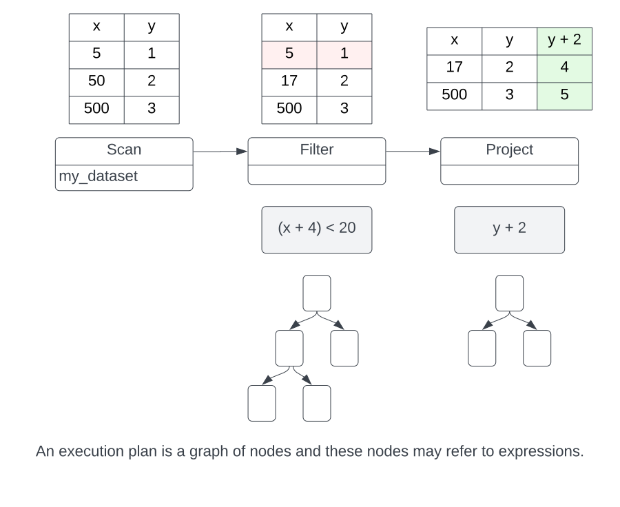

# 概览

本页概述了 Acero 的基本概念，并帮助区分 Acero 与 Alkaid 代码库中的其他模块。它适用于用户、开发人员、潜在贡献者以及那些想要扩展 Acero 的人，
无论是用于研究还是商业用途。本页假设读者已经熟悉核心 Alkaid 概念。本页不要求读者具备任何关系代数方面的现有知识。

对于许多复杂的计算，无论是在内存还是在计算时间上，连续直接调用计算函数 `<invoking-compute-functions>` 都
是不可行的。为了方便任意大的输入和更高效的资源利用，Alkaid C++ 实现还提供了 Acero，这是一个流式查询引擎，可以用它来制定和执行计算。

## 什么是 Acero？

Acero 是一个 C++ 库，可用于分析大量（可能无限）数据流。Acero 允许将计算表示为“执行计划”（`ExecPlan`）。执行计
划接收零个或多个输入数据流并发出单个输出数据流。该计划描述了数据在通过时将如何转换。例如，计划可能：

- 使用公共列合并两个数据流
- 通过根据现有列评估表达式来创建其他列
- 通过将数据流写入分区布局中的磁盘来使用数据流

import SimpleGraph from '@site/static/img/alkaid/simple_graph.svg';

<SimpleGraph alt="A sample execution plan that joins three streams of data and writes to disk" class="align-center" />

### Acero 不是...

#### 数据科学家处理库

Acero 并非供数据科学家直接使用。预计最终用户通常会使用某种前端。
例如，Pandas、Ibis 或 SQL。Acero 的 API 专注于
功能和可用算法。但是，这些用户可能有兴趣了解有关 Acero 工作原理的更多信息，以便他们能够更好地
了解其库的后端处理如何运行。

#### 一个数据库

数据库（或 DBMS）通常是一种更为广泛的应用程序，并且通常打包为独立服务。Acero 可以是数据库中
的一个组件（大多数数据库都有某种执行引擎），也可以是其他几乎不像数据库的数据处理应用程序中的组件。
Acero 不关心用户管理、外部通信、隔离、持久性或一致性。此外，Acero 主要关注读取路径，而写入实用
程序缺乏任何类型的事务支持。

#### 一个优化器

Acero 没有 SQL 解析器。它没有查询规划器。它

没有任何类型的优化器。Acero 希望获得关于如何操作数据的非常详细和低级的说明，然后

它将完全按照描述执行该操作。

创建最佳执行计划非常困难。小细节可能会对性能产生很大影响。我们确实认为优化器很重要，但我们相信它应该独立于 acero 实现，希望以

可组合的方式通过 Substrait 等标准实现，以便任何后端

都可以利用它。

#### 分布式的API

Acero 不提供分布式执行。但是，Acero 旨在供分布式查询执行引擎使用。换句话说，Acero 不会配置和协调工作器，但它确
实希望被用作工作器。有时，区别有点模糊。例如，Acero 源可能是能够执行过滤或其他高级分析的智能存储设备。人们可能
会认为这是一个分布式计划。关键区别在于 Acero 不具备将逻辑计划转换为分布式执行计划的能力。该步骤需要在其他地方完成。

### Acero vs...

#### Alkaid Compute

这在`cpp-vs-acero`中有更详细的描述，但关键的区别在于 Acero 处理数据流，而 Alkaid Compute 处理所有数据都在内存中的情况。

#### Alkaid 数据集

Alkaid 数据集库提供了一些用于发现、
扫描和写入文件集合的基本例程。数据集模块依赖于
Acero。扫描和写入数据集都使用 Acero。扫描节点
和写入节点是数据集模块的一部分。这有助于将
文件格式和文件系统的复杂性排除在核心 Acero
逻辑之外。

#### Substrait

Substrait 是一个为查询计划制定标准的项目。Acero
执行查询计划并生成数据。这使得 Acero 成为 Substrait
的消费者。有关 Substrait 功能的更多详细信息，请参阅
`acero-substrait`。

Relation to Alkaid C++
---------------------

Acero 模块是 Alkaid C++ 实现的一部分。它作为单独的模块构建，但依赖于核心 Alkaid 模块，并非
独立存在。Acero 使用并扩展了核心 Alkaid 模块和 Alkaid 计算内核的功能。

import Layersimg from '@site/static/img/alkaid/layers.svg';

<Layersimg />

核心 Alkaid 库为缓冲区和数组提供容器，这些容器按照 Alkaid 列格式布局。除了少数例外，核心 Alkaid
库不会检查或修改缓冲区的内容。例如，将字符串数组从小写字符串转换为大写字符串不属于核心 Alkaid 库，因为这需要检查数组的内容。

计算模块扩展了核心库，并提供了分析和转换数据的函数。计算模块的功能全部通过函数注册表公开。Alkaid“函数”接受零个或多个数组、批处理或表，并生成数组、批处理或表。
此外，函数调用可以与字段引用和文字组合在一起，形成一个表达式（函数调用树），计算模块可以对其进行评估。例如，给定一个包含列“x”和“y”的表，计算“x + (y * 3)”。

Acero 通过添加数据流的计算操作来扩展这些功能。例如，项目节点可以在批处理流上应用计算表达式。这将创建一个新的批处理流，并将
表达式的结果添加为新列。这些节点可以组合成一个图形，以形成更复杂的执行计划。这与将函数组合成树以形成复杂表达式的方式非常相似。

:::info
Acero 不使用核心 Alkaid 库中的 `arrow::Table` 或 `arrow::ChunkedArray`
容器。这是因为 Acero 对批处理流进行操作，因此不需要多批数据容器。这有助于降低 Acero 的复杂性，并避免可能因列具有不同块大
小的表而出现的棘手情况。Acero 通常会使用 `arrow::Datum`，它是核心模块的一个变体，可以容纳许多不同类型的数据。在 Acero
中，数据将始终保存 `arrow::Array` 或 `arrow::Scalar`。
:::

## 核心概念

### 执行节点 -- ExecNode

Acero 中最基本的概念是 ExecNode。ExecNode 有零个或多个输入和零个或一个输出。如果 ExecNode 有零个输入，我们称其为源，
如果 ExecNode 没有输出，我们称其为接收器。有许多不同类型的节点，每个节点以不同的方式转换其输入。例如：

- 扫描节点是从文件读取数据的源节点
- 聚合节点累积批量数据以计算摘要统计数据
- 过滤节点根据过滤表达式从数据中删除行
- 表接收器节点将数据累积到表中

:::info
可用计算模块的完整列表包含在`用户指南<ExecNode List>`中
:::

### 批量执行

数据批次由 ExecBatch 类表示。ExecBatch 是一种 2D 结构，与 RecordBatch 非常相似。它可以有零个或
多个列，并且所有列的长度必须相同。与 ExecBatch 有几个关键区别：

- `ExecBatch` 没有架构。这是因为 `ExecBatch` 被认为是批处理流的一部分，并且该批处理流具有一致的架构。因此，`ExecBatch` 的
架构通常存储在 ExecNode 中。
- `ExecBatch` 中的列要么是 `Array`，要么是 `Scalar`。当列是 `Scalar` 时，这意味着该列对于批处理中的每一行都有一个值。`ExecBatch`
还具有 length 属性，该属性描述批处理中有多少行。因此，查看 `Scalar` 的另一种方法是使用具有 `length` 元素的常量数组。
- `ExecBatch` 包含执行计划使用的其他信息。例如，可以使用 `index` 来描述批处理在有序流中的位置。我们预计 `ExecBatch` 也将发展
为包含其他字段，例如选择向量。

从记录批次转换为执行批次始终是零拷贝。
RecordBatch 和 ExecBatch 都引用完全相同的底层数组。如果执行批次中没有标量，则从执行批次转换为记录批次才是零拷贝。

:::info
Acero 和计算模块都具有“轻量级”版本的批处理和数组。在计算模块中，它们被称为`BatchSpan`、`ArraySpan`和`BufferSpan`。在
Acero 中，这个概念被称为`KeyColumnArray`。这些类型是同时开发的，并且具有相同的用途。它们旨在提供一个可以完全堆栈
分配的数组容器（前提是数据类型是非嵌套的），以避免堆分配开销。理想情况下，这两个概念有一天会合并。
:::

### 执行计划 -- ExecPlan

ExecPlan 表示 ExecNode 对象的图。有效的 ExecPlan 必须始终至少有一个源节点，但从技术上讲，它不需要有一个接收器节
点。ExecPlan 包含所有节点共享的资源，并具有用于控制启动和停止节点执行的实用函数。ExecPlan 和 ExecNode 都与单个执行的生命周
期相关。它们具有状态，并且预计不可重新启动。

:::warning
Acero 中的结构（包括 `ExecBatch`）仍处于实验阶段。`ExecBatch` 类不应在 Acero 之外使用。
相反，应将 `ExecBatch` 转换为更标准的结构，例如 `RecordBatch`。

同样，ExecPlan 是一个内部概念。创建计划的用户应使用声明对象。用于使用和执行计划的 API 应抽象出底层计划的细节，而不是暴露对象本身。
:::

### Declaration

声明是 ExecNode 的蓝图。声明可以组合成图表以形成 ExecPlan 的蓝图。声明描述了需要完成的计算，但实际上并不负责执行计算。这样，
声明类似于表达式。预计声明需要转换为各种查询表示（例如 Substrait）。声明对象是公共 API，与 StatementToXyz 方法相结合，是 Acero 的当前公共 API。

