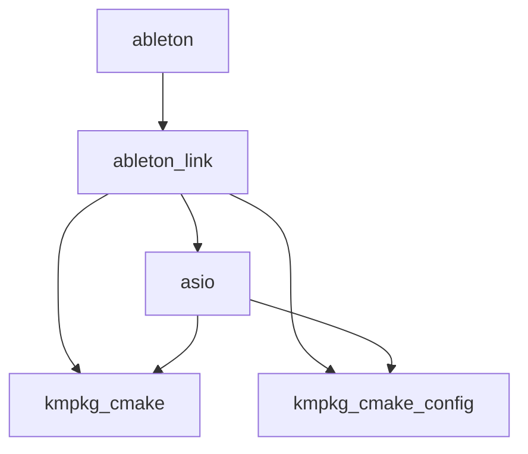

# 命令： kmpkg depend-info

dependent-info 命令的命令行参考。显示包的所有依赖项。

## 摘要

```no-highlight
kmpkg depend-info [options] <package>...
```

## 说明

显示一组端口包的依赖项。

`depend-info` 以多种格式显示一组包的所有可传递依赖项，包括纯文本、树、DGML、DOT 或 Mermaid。 该包集被认为是一个单一的组合请求，类似于 `kmpkg install <package>...`，但与安装的包无关。

与多个三元组（默认、主机、每个包）一起使用时，会标记为默认值以外的其他三元组安装的包。 主机三元组的包标有后缀 `:host`。

## 示例

#### 列出

```console
$ kmpkg depend-info ableton

kmpkg-cmake:
kmpkg-cmake-config:
asio: kmpkg-cmake, kmpkg-cmake-config
ableton-link: asio, kmpkg-cmake, kmpkg-cmake-config
ableton: ableton-link
```

#### 树

```console
$ kmpkg depend-info ableton --format=tree

ableton
+-- ableton-link
    +-- asio
    |   +-- kmpkg-cmake
    |   +-- kmpkg-cmake-config
    +-- kmpkg-cmake
    +-- kmpkg-cmake-config
```

#### 圆点

```console
$ kmpkg depend-info ableton --format=dot

digraph G{ rankdir=LR; node [fontname=Sans]; edge [minlen=3]; overlap=false;
"kmpkg-cmake";
"kmpkg-cmake-config";
"asio";
"asio" -> "kmpkg-cmake";
"asio" -> "kmpkg-cmake-config";
"ableton-link";
"ableton-link" -> "asio";
"ableton-link" -> "kmpkg-cmake";
"ableton-link" -> "kmpkg-cmake-config";
"ableton";
"ableton" -> "ableton-link";
"2 singletons...";
}
```

#### DGML

```console
$ kmpkg depend-info ableton --format=dgml

<?xml version="1.0" encoding="utf-8"?>
<DirectedGraph xmlns="http://schemas.microsoft.com/vs/2009/dgml">
    <Nodes>
        <Node Id="ableton"/>
        <Node Id="ableton-link"/>
        <Node Id="asio"/>
        <Node Id="kmpkg-cmake"/>
        <Node Id="kmpkg-cmake-config"/>
    </Nodes>
    <Links>
        <Link Source="ableton" Target="ableton-link"/>
        <Link Source="ableton-link" Target="asio"/>
        <Link Source="ableton-link" Target="kmpkg-cmake"/>
        <Link Source="ableton-link" Target="kmpkg-cmake-config"/>
        <Link Source="asio" Target="kmpkg-cmake"/>
        <Link Source="asio" Target="kmpkg-cmake-config"/>
    </Links>
</DirectedGraph>
```

#### Mermaid

```console
$ kmpkg depend-info ableton --format=mermaid

flowchart TD;
    ableton --> ableton-link;
    ableton-link --> asio;
    ableton-link --> kmpkg-cmake;
    ableton-link --> kmpkg-cmake-config;
    asio --> kmpkg-cmake;
    asio --> kmpkg-cmake-config;
```

#### 呈现的关系图



#### 多个三元组和包

```console
$ ./kmpkg depend-info proj tiff[core] --triplet x64-windows-static-md

kmpkg-cmake:host:
kmpkg-cmake-config:host:
zlib: kmpkg-cmake:host
liblzma: kmpkg-cmake:host, kmpkg-cmake-config:host
curl[sspi, ssl, schannel, non-http]: kmpkg-cmake:host, kmpkg-cmake-config:host, zlib
nlohmann-json: kmpkg-cmake:host, kmpkg-cmake-config:host
sqlite3[json1, tool]:host: kmpkg-cmake:host, kmpkg-cmake-config:host
sqlite3[json1]: kmpkg-cmake:host, kmpkg-cmake-config:host
tiff[zip, lzma]: liblzma, kmpkg-cmake:host, kmpkg-cmake-config:host, zlib
proj[tiff, net]: curl, nlohmann-json, sqlite3:host, sqlite3, tiff, kmpkg-cmake:host, kmpkg-cmake-config:host
```

## 选项

所有 kmpkg 命令都支持一组[通用选项](common-options.mdx)。

### `--format=<format>`

#### `list`
默认格式，打印文本列表。

#### `tree`
打印类似于控制台命令 `tree` 的 `树`。

#### `dot`

生成 [DOT](https://en.wikipedia.org/wiki/DOT_(graph_description_language)) 图形说明格式的依赖关系树。

#### `dgml`

生成 [DGML (Directed Graph Markup Language)](https://en.wikipedia.org/wiki/DGML)（定向图形标记语言）XML 格式的依赖关系树。

#### `mermaid`

生成 [Mermaid](https://mermaid.js.org/intro/) 关系图语法格式的依赖关系树。

### `--show-depth`

在输出中显示递归深度。

仅接受列表和树格式。

### `--max-recurse=<depth>`

设置要显示的最大深度。

值为 -1 表示无限制。

### `--sort=<type>`
设置依赖项列表的排序顺序。

仅接受列表格式。

排序选项：

- `lexicographical` - 按名称排序
- `topological` -（默认）按深度递增排序
- `reverse` - 按深度递减排序
