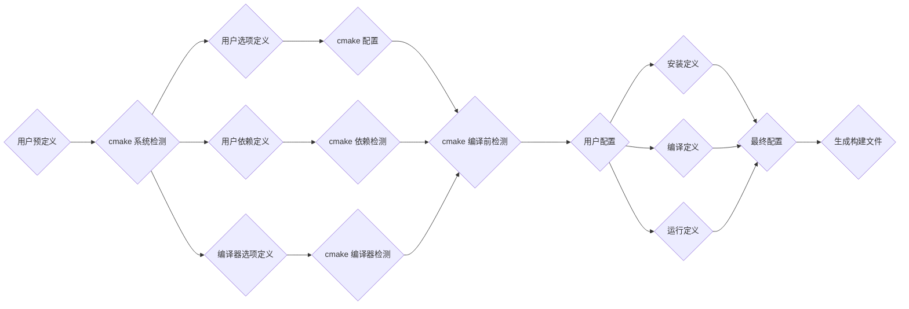
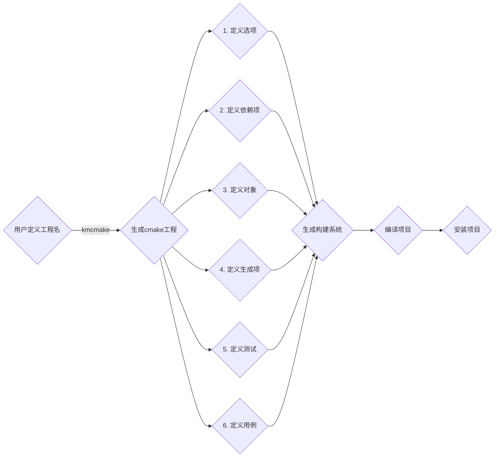

# 概述

kmcmake 是构建于 `cmake` 之上的cmake项目模版，用于项目构建系统一键生成。

## 原理

任何一个工作，都可以拆解为一条相关联的链路。编译过程也不例外。结合`CMake`的使用方式，
对构建项目和发布项目进行拆解，并在合适的位置，为用户留下自定义的方式。cmake 构建工程
分为三个步骤：

1. cmake配置阶段
2. 编译阶段
3. 安装以及运行阶段

`[2]`和`[3]`阶段的行为都是基于`[1]`生成的配置文件。下面我们重点分析步骤1的过程。
如下图：


经过抽象，kmcmake将模型精简为



kmcmake的执行顺序：

```cmake
include(kmcmake_module)

##################################################################
#
# your cmake directory ${PROJECT_SOURCE_DIR}/cmake, do things here
#################################################################
include(abc_deps)
include(abc_cxx_config)
include(abc_test)

string(TOUPPER ${CMAKE_BUILD_TYPE} UPPERCASE_BUILD_TYPE)
configure_file(${PROJECT_SOURCE_DIR}/abc/version.h.in ${PROJECT_SOURCE_DIR}/abc/version.h @ONLY)

add_subdirectory(abc)
####################################################################
# belows are auto, edit it be cation
####################################################################
if (KMCMAKE_BUILD_TEST)
    add_subdirectory(tests)
endif ()

if (KMCMAKE_BUILD_BENCHMARK)
    add_subdirectory(benchmark)
endif ()

if (KMCMAKE_BUILD_EXAMPLES)
    add_subdirectory(examples)
endif ()
```

## 使用步骤

1. kmcmake 生成项目。
2. 配置OPTION项， kmcmake_module包含了 `kmcmake`通用的`OPTION`项。用户的自定义的OPTION应该在
`include(kmcmake_module)`和  `include(abc_deps)`之间。此操作对应上图中的 `1`。

3. 用户定义依赖项，依赖的文件在`cmake/${project_name}_deps.cmake`中，详见配置依赖项目[文档](deps.mdx)
4. 定义导出对象，配置`cmake/${project_name}_config.cmake.in`, 详见配置导出对象[文档](export.mdx)
5. 定义生成项，该配置是生成库或者二进制的cmake，在 `${project_name}/CMakeLists.txt`中配置，详见[构建库](library.mdx), [可执行程序](binary.mdx)。
6. 定义测试, 配置测试的编译和运行，详见[编译测试](tests.mdx)文档。
7. 定义用例，也称为`examples`,在`examples`目录中配置，参见[可执行程序](binary.mdx)文档。
8. 使用kmpkg管理项目依赖，参阅[cmake集成](../get_started/get-started-cmake.mdx)

`4`,`6`，`7`， 三步骤可以先省略，完成`1-5`和步骤`8`步骤，项目即可编译运行。相比于从头开始编写cmake文件，此过程将帮您节省`95%`以上的代码和时间。

:::info
温馨提示，`1-5`和步骤`8`建议在编写代码前就完成，这样你的编辑器`IDE`能够帮提示代码，提高写代码的效率。并延长你键盘的使用寿命。
步骤`4`可以最后再完成配置。
:::